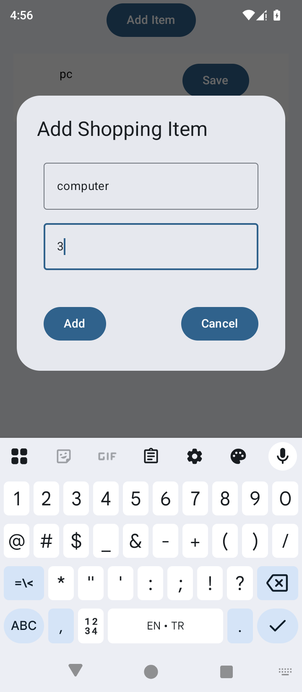
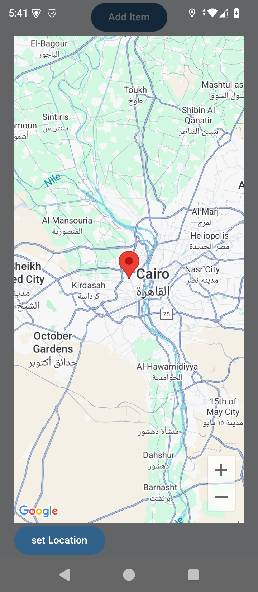

# Shopping List App

## Description

This is a simple Android shopping list app built using **Kotlin** and **Jetpack Compose**. It allows users to manage their shopping lists by adding, editing, and deleting items.User can add Address from teh Google Maps to each item in the list. The app provides a clean and intuitive interface for users to keep track of their shopping needs.

## Features

- **Add Items**: Users can add new items to their shopping list.
- **Edit Items**: Modify existing items to update details.
- **Delete Items**: Remove items from the list when no longer needed.
- **Add Addresses**: User can add Address from teh Google Maps to each item in the list.
- **Intuitive UI**: Built with Jetpack Compose for a modern, responsive interface.
- **Real-time Updates**: The list updates instantly as items are added, edited, or deleted.

## Screenshots

For a visual overview, check the screenshot above or explore the app in the emulator/device.

## Installation

1. Clone or download this repository.
2. Open the project in **Android Studio**.
3. Ensure you have the latest **Android SDK** and **Jetpack Compose** dependencies.
4. Build and run the app on an Android device or emulator .

## How to Use

1. Open the app to view the shopping list.
2. Tap the "Add" button to input a new item.
3. Add address from the Google map to the item.
4. Select an item to edit its details or delete it.
5. Changes are reflected immediately in the list.

## Tech Stack

- **Language**: Kotlin
- **UI Framework**: Jetpack Compose
- **Build Tool**: Gradle
- **Target SDK**: Android 14 (API 34)